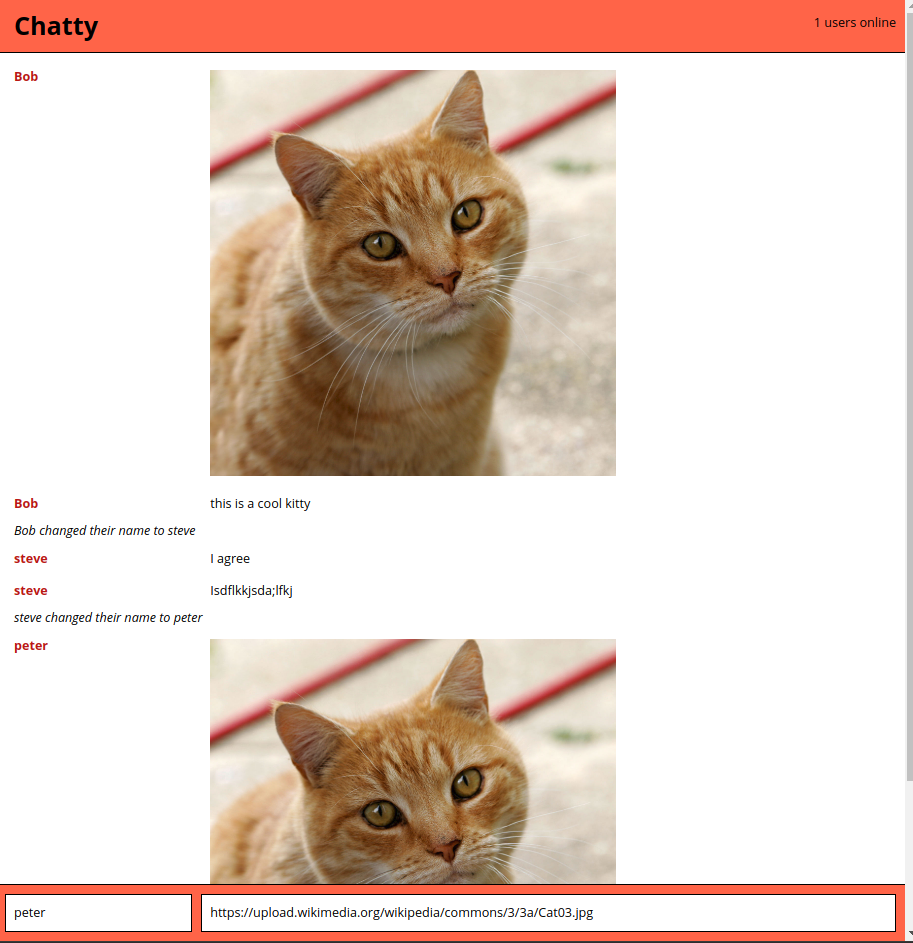

React Boilerplate
=====================

A minimal and light dev environment for ReactJS.

### Usage

Clone the boilerplate and create your own git repo.

```
git clone git@github.com:lighthouse-labs/react-simple-boilerplate.git
cd react-simple-boilerplate
git remote rm origin
git remote add origin [YOUR NEW REPOSITORY]
# Manually update your package.json file
```

Install the dependencies and start the server.

```
'npm install'
'npm start' in main directory to open http://localhost:3000 for main server port
'npm start' in the chatter-server directory to open 3001 port for the client communication
```

### Linting

This boilerplate project includes React ESLint configuration.

```
npm run lint
```

### Dependencies

* React
* Webpack
* [babel-loader](https://github.com/babel/babel-loader)
* [webpack-dev-server](https://github.com/webpack/webpack-dev-server)



